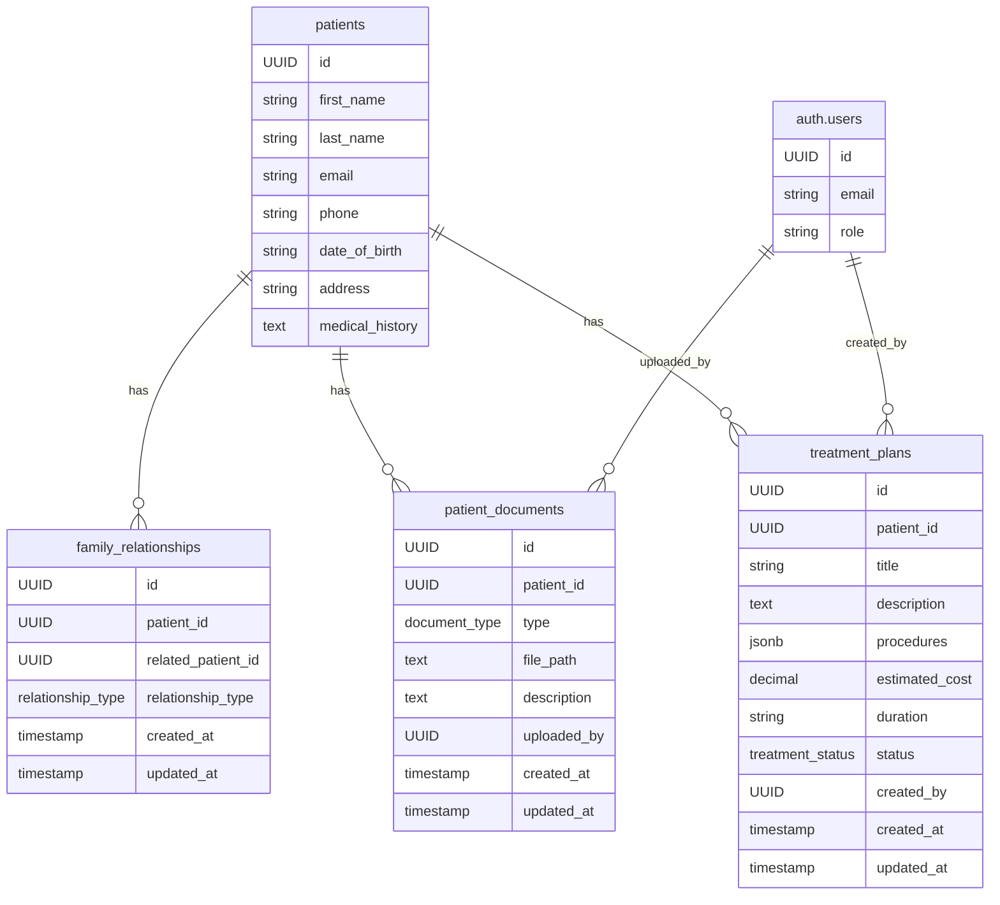
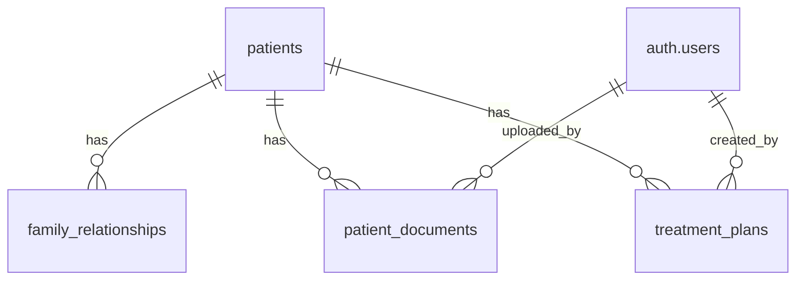
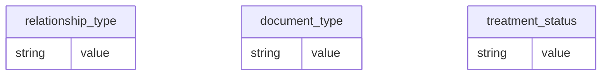

# Entity Relationship Diagrams (ERD)

## Patient-Related Entities



## Relationships



## Enums



## Detailed Relationships

```mermaid
erDiagram
    patients {
        UUID id
        string first_name
        string last_name
        string email
        string phone
        string date_of_birth
        string address
        text medical_history
    } ||--o{ family_relationships : "has"
    patients ||--o{ patient_documents : "has"
    patients ||--o{ treatment_plans : "has"
    
    family_relationships {
        UUID id
        UUID patient_id
        UUID related_patient_id
        relationship_type relationship_type
        timestamp created_at
        timestamp updated_at
    } }|--|| patients : "references"
    
    patient_documents {
        UUID id
        UUID patient_id
        document_type type
        text file_path
        text description
        UUID uploaded_by
        timestamp created_at
        timestamp updated_at
    } }|--|| patients : "references"
    
    treatment_plans {
        UUID id
        UUID patient_id
        string title
        text description
        jsonb procedures
        decimal estimated_cost
        string duration
        treatment_status status
        UUID created_by
        timestamp created_at
        timestamp updated_at
    } }|--|| patients : "references"
    
    auth.users {
        UUID id
        string email
        string role
    } ||--o{ patient_documents : "uploaded_by"
    auth.users ||--o{ treatment_plans : "created_by"